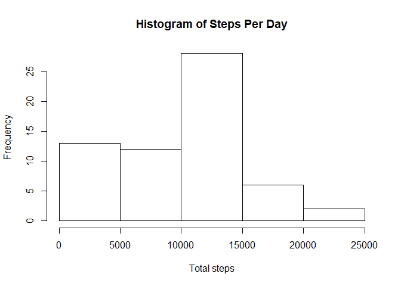
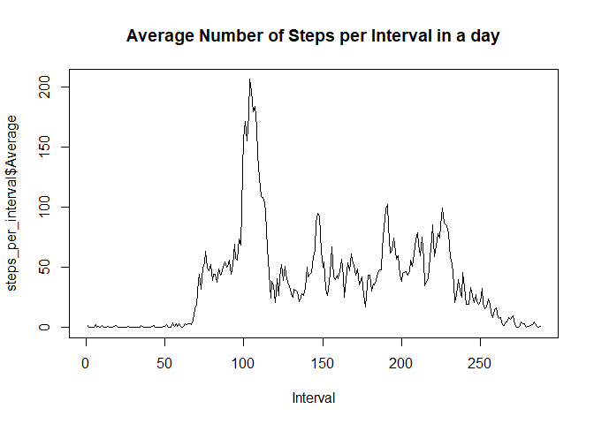
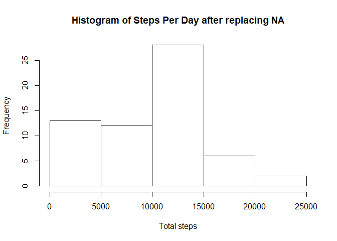

## Loading and preprocessing the data

The following piece of code will load libaries, load and preprocess the data.

```r
library(dplyr)
```

```
## Warning: package 'dplyr' was built under R version 3.5.3
```

```
## 
## Attaching package: 'dplyr'
```

```
## The following objects are masked from 'package:stats':
## 
##     filter, lag
```

```
## The following objects are masked from 'package:base':
## 
##     intersect, setdiff, setequal, union
```

```r
library(lattice)
unzip("activity_data.zip")
data <- read.csv("activity.csv")

steps_per_day <- data %>% group_by(date) %>% summarize(sum=sum(steps,na.rm=TRUE),mean=mean(steps,na.rm = TRUE))

steps_per_interval <- data %>% group_by(interval) %>% summarize(Average=mean(steps,na.rm = TRUE))
```

## What is mean total number of steps taken per day?

Total number of steps taken per day:

```r
print(steps_per_day)
```

```
## # A tibble: 61 x 3
##    date         sum    mean
##    <fct>      <int>   <dbl>
##  1 2012-10-01     0 NaN    
##  2 2012-10-02   126   0.438
##  3 2012-10-03 11352  39.4  
##  4 2012-10-04 12116  42.1  
##  5 2012-10-05 13294  46.2  
##  6 2012-10-06 15420  53.5  
##  7 2012-10-07 11015  38.2  
##  8 2012-10-08     0 NaN    
##  9 2012-10-09 12811  44.5  
## 10 2012-10-10  9900  34.4  
## # ... with 51 more rows
```

Histogram of steps taken per day:

```r
hist(steps_per_day$sum,xlab="Total steps",main="Histogram of Steps Per Day")
```

<!-- -->

Mean and median number of steps per day:

```r
mean(steps_per_day$sum,na.rm = TRUE)
```

```
## [1] 9354.23
```

```r
median(steps_per_day$sum,na.rm = TRUE)
```

```
## [1] 10395
```


## What is the average daily activity pattern?


Time series of 5 minute intervals' average number of steps:

```r
plot(steps_per_interval$Average,type="l",xlab="Interval",main="Average Number of Steps per Interval in a day")
```

<!-- -->

Interval with maximal number of steps:

```r
which.max(steps_per_interval$Average)
```

```
## [1] 104
```

## Imputing missing values


Total number of missing values in the dataset:

```r
sum(is.na(data$steps) == TRUE)
```

```
## [1] 2304
```

Code below  replaces NA values from the dataset by the average of the day.


```r
for ( i in 1:length(steps_per_day$mean)) {
  data[data$date %in% steps_per_day$date[i] & is.na(data$steps), "steps"] <- steps_per_day$mean[i]
}
```


```r
hist(steps_per_day$sum,xlab="Total steps",main="Histogram of Steps Per Day after replacing NA")
```

<!-- -->

Mean and median number of steps per day after replacing NA values:

```r
mean(steps_per_day$sum,na.rm = TRUE)
```

```
## [1] 9354.23
```

```r
median(steps_per_day$sum,na.rm = TRUE)
```

```
## [1] 10395
```

The strategy of replacing NA values with daily average is not working well, because most of the day have all values missing, hence there is no impact of on NA values.

## Are there differences in activity patterns between weekdays and weekends?


```r
for ( i in 1:dim(data)[1] ) {
  if ( weekdays(as.Date(data$date[i])) == "Sunday" | weekdays(as.Date(data$date[i])) == "Saturday" ) {
    data$new[i] <- "weekend"
  }
  else {
    data$new[i] <- "weekday"
  }
}
steps_per_interval_2 <- data %>% group_by(interval,new) %>% summarize(Average=mean(steps,na.rm = TRUE))
xyplot(steps_per_interval_2$Average ~ steps_per_interval_2$interval|steps_per_interval_2$new,xlab="Interval",ylab="Number of steps",layout=c(1,2),type="l")
```

<!-- -->
